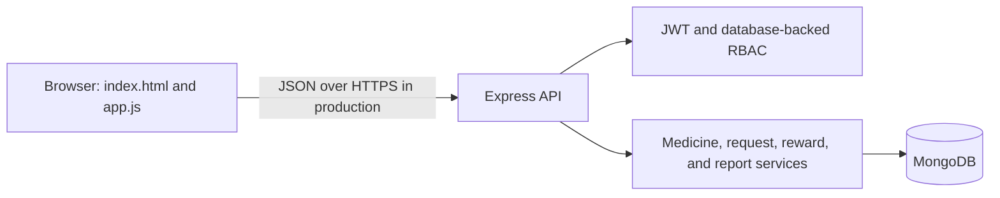
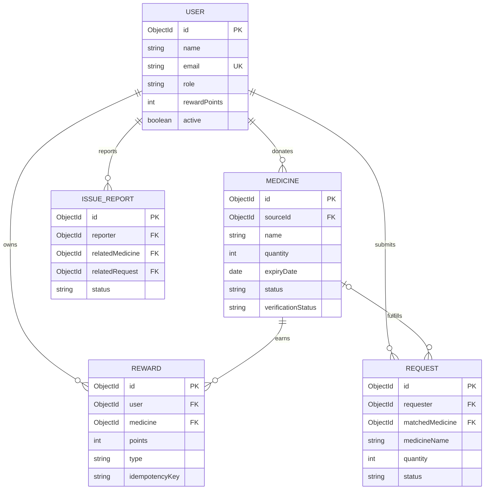
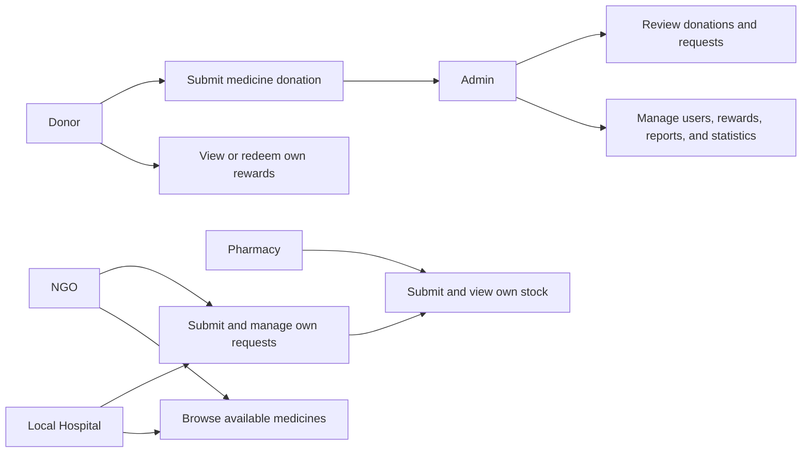
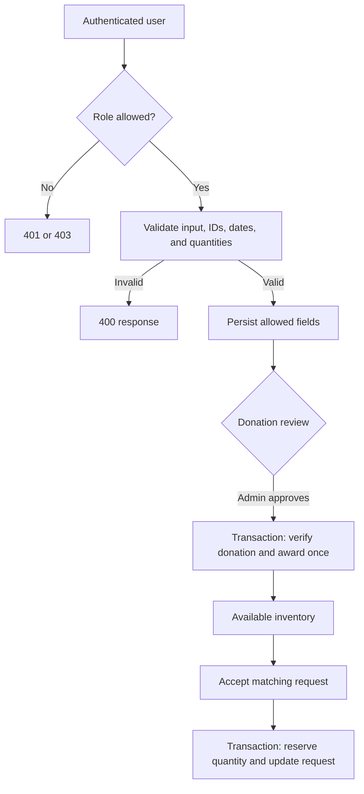

# MediBridge architecture

## System architecture

## Data model (ER)

The legacy `Donation` model is not currently used by a route; donation records are represented by `Medicine` documents with source and review fields.

## Use cases

## Donation and request flow

